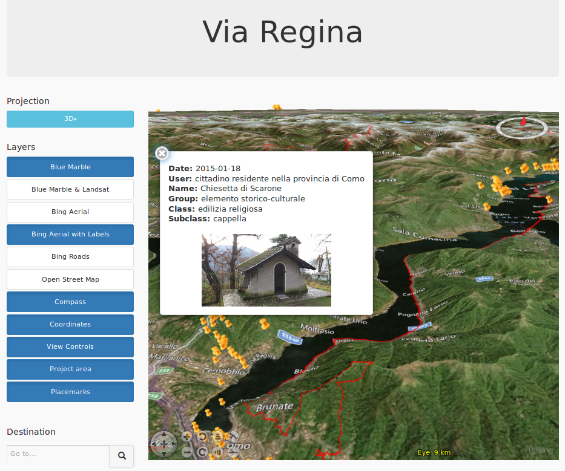

# Via Regina 3D

Via Regina 3D is built using NASA Web WorldWind API. It visualizes data collected using <a href="http://www.viaregina.eu/app">ODK application</a> and <a href="http://viaregina3.como.polimi.it/app/">Cordova application</a> developed in <a href="http://www.viaregina.eu/">Via Regina project</a>. 

It is accesible at http://viaregina3.como.polimi.it/WorldWind/. 

